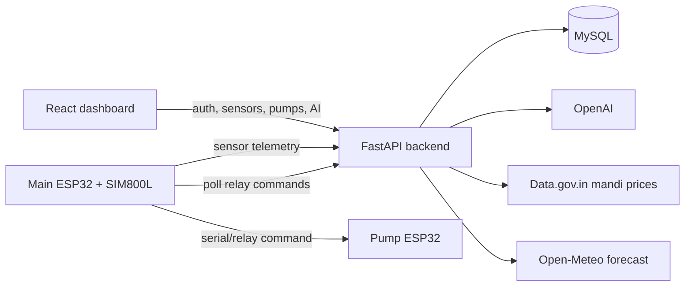

# CropConnect

CropConnect is an AI-assisted farming platform for ESP32 sensor telemetry, pump control, crop planning, weather, and live mandi market insight. The frontend is a React/Vite dashboard, and the backend is a FastAPI service backed by MySQL.

## Architecture



## Repository Layout

- `cropconnect-backend/` - FastAPI API, MySQL migrations, AI/market/weather integrations, ESP32 ingest endpoints.
- `cropconnect-frontend/` - React/Vite web app and dashboard.
- `docker-compose.yml` - Local MySQL + backend + frontend stack.
- `.github/workflows/ci.yml` - Automated backend/frontend checks.

## Quick Start

### Docker

```bash
docker compose up --build
```

Then open:

- Frontend: `http://localhost:3000`
- Backend health: `http://localhost:8001/api/health`

### Local Backend

```bash
cd cropconnect-backend
python -m venv .venv
.venv/Scripts/activate  # Windows
pip install -r requirements.txt
python migrate_db.py
uvicorn esp32_ingest:app --host 0.0.0.0 --port 8001
```

### Local Frontend

```bash
cd cropconnect-frontend
npm ci
npm run start
```

## Environment

Copy the example files and fill in your own secrets:

- `cropconnect-backend/.env.example`
- `cropconnect-frontend/.env.example`

Never commit `.env` files. They are intentionally ignored.

## Checks

```bash
cd cropconnect-backend
python -m unittest discover -s tests
ruff check .

cd ../cropconnect-frontend
npm run lint
npm run test
npm run check
npm run build
```

## Documentation

- Backend details: [`cropconnect-backend/README.md`](cropconnect-backend/README.md)
- Frontend details: [`cropconnect-frontend/README.md`](cropconnect-frontend/README.md)

## GitHub Metadata

Suggested repository metadata:

- Description: `AI-assisted farming dashboard for ESP32 sensors, pump control, crop planning, weather, and mandi market insights.`
- Topics: `python`, `fastapi`, `react`, `iot`, `agriculture`, `esp32`, `mysql`, `openai`
- Website: your deployed frontend URL, for example `https://cropconnect01.vercel.app/`
